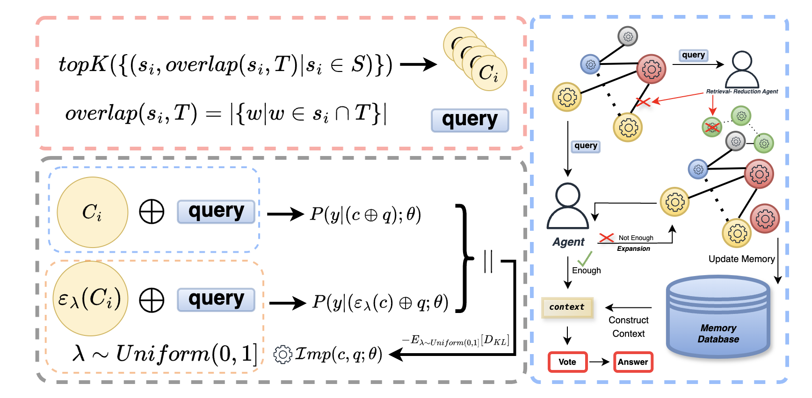
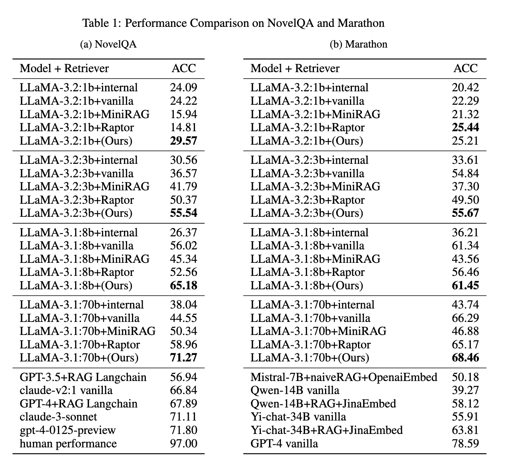
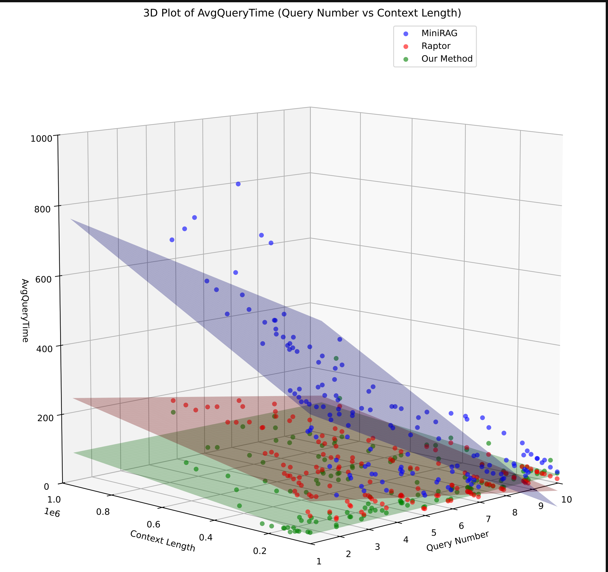

<p align="center">
  <a href="https://arxiv.org/abs/2505.11908">
    
  </a>
</p>


# ELITE: Embedding-Less retrieval with Iterative Text Exploration

Large Language Models (LLMs) have achieved impressive progress in natural language processing, but their limited ability to retain long-term context constrains performance on document-level or multi-turn tasks. Retrieval-Augmented Generation (RAG) mitigates this by retrieving relevant information from an external corpus. However, existing RAG systems often rely on embedding-based retrieval trained on corpus-level semantic similarity, which can lead to retrieving content that is semantically similar in form but misaligned with the question's true intent. Furthermore, recent RAG variants construct graph- or hierarchy-based structures to improve retrieval accuracy, resulting in significant computation and storage overhead. In this paper, we propose an embedding-free retrieval framework. Our method leverages the logical inferencing ability of LLMs in retrieval using iterative search space refinement guided by our novel importance measure and extend our retrieval results with logically related information without explicit graph construction. Experiments on long-context QA benchmarks, including NovelQA and Marathon, show that our approach outperforms strong baselines while reducing storage and runtime by over an order of magnitude. 

## Table of Contents
- [Features](#features)
- [Project Structure](#project-structure)
- [🔧 Installation & Quick Start](#-installation--quick-start)
- [Framework](#Framework)
- [Performance Analysis](#Performance-Analysis)
- [📄 How to Get Results on NovelQA and Marathon](#-how-to-get-results-on-novelqa-and-marathon)


## Features

- **Embedding-Free Retrieval**: Eliminates the reliance on embedding models and dense retrievers.

- **Fast Response & Deployment**: Minimal offline preparation and indexing time enables fast responses and rapid deployment.

- **Lightweight Reasoning**: Utilizes LLMs’ native lexical and reasoning abilities—no need to construct graph or tree databases.

- **Strong Performance**: Outperforms baselines on long-context QA benchmarks such as NovelQA and Marathon.

## Project Structure

- `src/`: Core implementation of the embedding-free RAG framework.
- `reproduce/`: Scripts for reproducing experiments.
- `demo.py`: A runnable demo to test the pipeline.
- `requirements.txt`: List of dependencies.
- `.gitignore`: Standard ignored files.
- `Readme.md`: Project documentation.

## 🔧 Installation & Quick Start

### Use with pip install
```bash
conda create -n your_env python=3.11
conda activate your_env
pip install eliteRAG
```
here is a minial example to use this:
```bash
import elite.core_functions as cf
import local_config as cfg

# ====== Configuration ======
cfg.set_config(
    recall_index=25,
    neighbor_num=1,
    deep_search_index=5,
    deep_search_num=25,
    voter_num=5,
    num_ctx=70000,

    retrieve_iter_max_iterations=5,
    retrieve_iter_suff_provider="deepseek",

    common_model="llama3.1:latest",
    llm_provider="ollama",
    use_fallback=True,

    deepseek_api_key="",
    deepseek_model="deepseek-chat",
    deepseek_base_url="https://api.deepseek.com/v1",
)

# ====== Minimal example ======
text = """
Alice lived in a small village near the mountains.
Every morning she walked through the forest to reach the river,
where she collected fresh water for her family.
One day, she discovered strange footprints leading deeper into the woods.
"""

query = "Why did Alice go to the river every morning?"

retrieve_resp = cf.retrieve_iter(text, query)
answer = cf.send(retrieve_resp["retrieve_data"] + query)

print(answer)

```

###  Environment setup

```bash
# Clone the repository
git clone https://github.com/tjzvbokbnft/ELITE-Embedding-Less-retrieval-with-Iterative-Text-Exploration.git
cd ELITE-Embedding-Less-retrieval-with-Iterative-Text-Exploration

# Create & activate a clean conda env (Python 3.11)
conda create -n ELITE python=3.11 -y
conda activate ELITE

# Install core dependencies
pip install -r requirements.txt
```
### Quick demo
```bash
#string_noise --> optional (To use this package, you must manually add it to your site-packages directory.
#If you don't need it, simply delete the related code. -->using without the importance metric)

#play with demo
#config your txt path in demo.py
#config other parameters in scr/local_config.py

python demo.py
```
### Benchmark reproduction
```
# Reproduce on NovelQA benchmark
python reproduce/test_novelQA.py

# Reproduce on Marathon benchmark
python reproduce/test_marathon.py
```
### Command-line interface (CLI)
```bash
# Minimal run (uses default novel path)
python cli_agent.py
# Change only the model & neighbor count
python cli_agent.py --common_model llama3.1:latest --neighbor_num 2
# Full control
python cli_agent.py \
  --novel nvQA/Frankenstein.txt \
  --recall_index 6 \
  --neighbor_num 15 \
  --deep_search_index 4 \
  --deep_search_num 25 \
  --voter_num 5 \
  --num_ctx 10000 \
  --common_model llama3.1:latest
```
### Use as an API
```
from pathlib import Path
from src import core_functions

# 1️⃣  Load text
context = Path("nvQA/Frankenstein.txt").read_text(encoding="utf-8")

# 2️⃣  Bootstrap cache & query
keywords_cache = ""        # Empty on first call
question       = "What motivates Victor to create life?"

# 3️⃣  Retrieve
resp = core_functions.retrieve_useful(
    text_input=context,
    query=question,
    cached_keywords=keywords_cache,
)

# 4️⃣  Grab results
relevant_text   = resp["retrieve_data"]
new_keywords    = resp["keywords_extracted"]
keywords_cache += new_keywords      # accumulate for next round

print(relevant_text)
print("Newly mined keywords:", new_keywords)

```


## Framework

## Performance Analysis

### QA Retrieval Accuracy


### Average Query Time by Context Length and Query Volume


### Total Time Consumption by Context Length


## 📄 How to Get Results on NovelQA and Marathon

### 📊 Benchmark & Evaluation

To evaluate the performance of this framework on **NovelQA** and **Marathon**, please follow the official benchmarking instructions:

#### 📘 NovelQA
- [GitHub Repository](https://github.com/NovelQA/novelqa.github.io)
- [Official leaderboard](https://novelqa.github.io/)
  

#### 🏃 Marathon
- [GitHub Repository](https://github.com/Hambaobao/Marathon)
- [Submission](https://openbenchmark.online/marathon/)

## License
- MIT 
  
## Citation

If **ELITE** assists in your research, please cite us:

```bibtex
@misc{wang2025elite,
  title     = {ELITE: Embedding-Less Retrieval with Iterative Text Exploration},
  author    = {Wang, Zhangyu and Gao, Siyuan and Zhou, Rong and Wang, Hao and Ning, Li},
  year      = {2025},
  eprint    = {2505.11908},
  archivePrefix = {arXiv},
  primaryClass  = {cs.CL},
  url       = {https://arxiv.org/abs/2505.11908}
}


